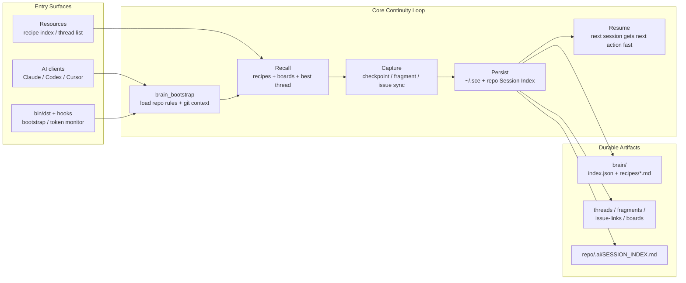

# BrainKeeper

> **"One who truly knows you"**

Personal Cognitive Substrate — 跨项目、跨 session 的第二大脑

## Quick Install

```bash
curl -fsSL https://raw.githubusercontent.com/CtriXin/brainkeeper/main/install.sh | bash
```

## Install via AI Agent

Paste this single line into **Claude Code / Cursor / Codex** — the agent will handle the rest:

```
Install BrainKeeper MCP server by running: curl -fsSL https://raw.githubusercontent.com/CtriXin/brainkeeper/main/install.sh | bash — it handles everything including MCP config. Restart the client after install.
```

---

## What is BrainKeeper?

BrainKeeper 是一个 MCP server，为 AI coding agent 提供持久化的知识层：

```
传统 AI：  Session → Forget → Session → Forget
Memory：  Session → Store → Recall → Session
BrainKeeper： Session → Learn → Cross-Project Recall → Evolve
```

核心差异化价值：
- **Recipe** — 结构化的实现经验，带触发词匹配，跨项目复用
- **Board** — 四象限看板 + 备忘，项目级任务管理
- **Thread** — 上下文蒸馏，跨 session 恢复工作状态
- **主动推送** — bootstrap 时自动匹配相关经验，不需手动查询

相关设计文档：
- `docs/DISTILL_DESIGN.md` — distill / checkpoint 的原始闭环设计
- `docs/WORKLOG_MEMORY_DESIGN.md` — fragment / reflection / distill / issue sync / gbrain-memory 的完整分层设计

---

<!-- repo-graphics:workflow-start -->
## Workflow Overview

> This repo keeps the public flow in Mermaid so open-source history does not accumulate HTML/PNG card assets.


<!-- repo-graphics:workflow-end -->

## Installation

### One-line Install (Recommended)

```bash
curl -fsSL https://raw.githubusercontent.com/CtriXin/brainkeeper/main/install.sh | bash
```

This clones BrainKeeper to `~/.local/share/brainkeeper`, installs dependencies, and prints the MCP config to add.

### Manual Install

```bash
git clone https://github.com/CtriXin/brainkeeper.git ~/.local/share/brainkeeper
cd ~/.local/share/brainkeeper
npm install --production
```

dist/ is pre-built in the repo — no build step needed.

### Update

```bash
cd ~/.local/share/brainkeeper && git pull && npm install --production
# Or:
curl -fsSL https://raw.githubusercontent.com/CtriXin/brainkeeper/main/install.sh | bash -s -- --update
```

### Install a specific tag or branch

```bash
curl -fsSL https://raw.githubusercontent.com/CtriXin/brainkeeper/main/install.sh | bash -s -- --ref v2.4.0
curl -fsSL https://raw.githubusercontent.com/CtriXin/brainkeeper/main/install.sh | bash -s -- --ref main
```

### MCP Configuration

Add to your MCP config file:

| Client | Config File |
|--------|------------|
| Claude Code | `~/.claude/settings.json` |
| Cursor | `.cursor/mcp.json` |
| Windsurf | `.windsurfrules/mcp.json` |

```json
{
  "mcpServers": {
    "brainkeeper": {
      "command": "node",
      "args": ["~/.local/share/brainkeeper/dist/server.js"]
    }
  }
}
```

> **Note:** Replace `~` with your actual home directory path if your client doesn't expand `~`.
> Example: `"/Users/yourname/.local/share/brainkeeper/dist/server.js"`

### MMS (Isolated Environment) Notes

MMS rewrites `HOME` to an isolated session path. BrainKeeper's install script auto-detects this and installs to your **real** home directory so the installation persists across sessions.

**Symlink issues:** MMS may not support symlinks by default. The install script uses `npm` (not `pnpm`) to avoid this. If you must use pnpm:

```bash
echo 'node-linker=hoisted' >> ~/.local/share/brainkeeper/.npmrc
cd ~/.local/share/brainkeeper && pnpm install
```

---

## MCP Tools

### Knowledge — 知识管理

| 工具 | 用途 |
|------|------|
| `brain_learn` | 从完成的任务中提取可复用 recipe，持久化到知识库 |
| `brain_recall` | 根据任务描述查找相关 recipe，返回步骤/文件/坑点 |
| `brain_list` | 列出所有 recipe 摘要（支持按 project/tag/framework 过滤） |

### Distill — 上下文蒸馏

| 工具 | 用途 |
|------|------|
| `brain_bootstrap` | 轻量启动入口 — board 信号 + thread 恢复 + recipe 自动推送 |
| `brain_checkpoint` | 蒸馏当前工作状态，写入 thread 文件供跨 session 恢复 |
| `brain_fragment` | 记录一个连续工作片段，适合开发/探索/debug/修复过程中随时留痕 |
| `brain_link_issue` | 把当前 thread chain 的 root 显式绑定到一个 `issue-tracking` issue slug |
| `brain_sync_issue` | 把当前 thread chain 的 digest 同步到 `issue.md` 的固定 Mindkeeper 区块 |
| `brain_threads` | 列出所有未过期的 thread，按 repo 分组 |

`brain_checkpoint` 还会为当前项目维护一份本地 `Session Index`：

- 路径：`<repo>/.ai/SESSION_INDEX.md`
- 字段：`time / cli / model / folder / task / status / thread id`
- 作用：同一项目开很多窗口后，直接进项目目录就能看出最近 distill 过什么、该恢复哪个 `dst-...`
- 回填：`bk dst sync` 可根据现有 thread 重建当前项目索引

`brain_fragment` 和 `brain_checkpoint` 的边界：

- `brain_fragment`：小步留痕。每做完一段开发、探索、debug、修复就追加一条，不要求立刻蒸馏。
- `brain_checkpoint`：阶段压缩。把当前阶段沉淀成新的 `dst-*` 快照，供跨 session 恢复。
- 两者不冲突：同一条任务链会共享一个 `root`，新的 checkpoint 仍能看到此前 fragments。

`brain_link_issue` / `brain_sync_issue` 的使用方式：

- 先设置环境变量：`BRAINKEEPER_ISSUE_TRACKING_ROOT=/path/to/issue-tracking`
- 第一次绑定：调用 `brain_link_issue(repo, issue, project?)`
- 需要归档时：调用 `brain_sync_issue(repo, thread?)`
- 当前实现是显式同步，不会每写一条 fragment 就自动刷 `issue.md`

### Board — 项目看板

| 工具 | 用途 |
|------|------|
| `brain_board` | 读写项目四象限看板（紧急/重要矩阵）+ 备忘 |
| `brain_check` | 扫描所有项目信号（deadline/overdue/stale）+ recipe 健康 |

---

## Storage

所有数据存储在 `~/.sce/` 下：

```
~/.sce/
├── brain/
│   ├── index.json          # Recipe 索引（快速查找）
│   └── recipes/*.md        # Recipe 文件（frontmatter + markdown）
├── threads/                # Thread 蒸馏文件（dst-YYYYMMDD-*.md）
├── fragments/              # Thread 链下的持续工作片段（<root>.jsonl）
├── issue-links/            # root -> issue-tracking 显式映射（<root>.json）
└── boards/                 # Board JSON 文件（每个项目一个）
```

项目目录内会按需生成：

```
<repo>/.ai/SESSION_INDEX.md  # 项目内 session/thread 索引，便于 crash 后找回
```

### Recipe 格式

```markdown
---
id: ad-lazy-load
triggers: ["广告延迟加载", "ad lazy load"]
summary: Vue3 广告延迟加载 hook
framework: vue3
project: ptc_ssr_crypto
confidence: 0.9
tags: ["ads", "intersection-observer"]
---
## 实现步骤
1. 创建 useAdLazyLoad composable
2. ...

## 涉及文件
- `src/composables/useAdLazyLoad.ts` — 核心 hook

## 已知坑点
- iOS Safari IntersectionObserver 需要 polyfill

## Changelog
- 2026-03-27: 首次记录
```

### Recipe 归档约定

BrainKeeper 默认不鼓励把每一条零散经验都拆成新 recipe。推荐按下面的边界维护：

- **新建 recipe**：
  这个经验已经是稳定流程，未来会高频复用，而且单独 recall 会更清楚。
- **并入已有 recipe**：
  这个经验只是同一主题下的新补充，拆出去只会让知识变散。

建议优先按 3 类归属：

- **全局工具 recipe**：
  跟具体项目无关，跨项目都会反复遇到。
  例子：`lark-cli`、Feishu 表格定位、隔离 `HOME`、MMS 启动环境。
- **项目 recipe**：
  只属于某个项目的结构、流程、坑点。
  例子：某个 repo 的页面骨架、默认 bug 表、静态注入规则。
- **临时 thread / board 信息**：
  还没有稳定成方法论，只是这一次任务的上下文或提醒。

可以用下面的判断顺序：

1. 这条经验未来会不会在多个项目里重复出现？
2. 它是不是已经形成固定排查顺序或命令模板？
3. 单独建一个 recipe 会不会比塞进现有 recipe 更好找？

如果 1 和 2 都是"是"，通常应该新建。
如果只有局部补充价值，通常应并入已有 recipe。

当前推荐的治理方式：

- `rcp-brainkeeper-*`：BrainKeeper 自身工作流与跨项目规则
- `rcp-lark-*`：Feishu / `lark-cli` / 表格查改流程
- `rcp-mms-env-*`：隔离环境 / `HOME` / 启动问题
- `rcp-<project>-*`：某个具体项目的业务经验

一个实用原则：

- **高频、跨项目、稳定复用** → 新建
- **项目专属、不会外溢** → 放项目 recipe
- **零散补充、还不稳定** → 先并入已有 recipe 或留在线程/看板

### Thread 格式

```markdown
---
id: dst-20260327-abc123
repo: /path/to/your-project
task: 修复登录Bug
branch: fix/login
parent: dst-20260326-xyz789
cli: codex
model: gpt-5.4
folder: src/auth
created: 2026-03-27T15:08:38.729Z
ttl: 7d
---
## 决策
- 用 JWT 替换 session cookie

## 变更
- auth.ts
- middleware.ts

## 待续
- [ ] 部署验证

## 当前状态
JWT 替换完成，待部署
```

---

## Key Features (v2.1)

### Recall 语义匹配
- 55+ 同义词组（前端/后端/DevOps/通用）
- Trigram 模糊匹配（精确匹配失败时 fallback）
- Tags 参与评分
- CamelCase/kebab-case 自动拆分 + 30+ 缩写展开

### Bootstrap 自动推送
- `brain_bootstrap` 冷启动时自动用 task 描述匹配 recipe
- 输出 ≤3 条摘要提示，不需手动调 `brain_recall`
- 不更新访问统计，避免污染衰减信号

### Recipe 衰减 & 遗忘
- 90+ 天未访问 / confidence < 0.7 / 框架过时 → 标记 ⚠️
- `brain_check` 时自动降权：accessCount=0 且 180+ 天 → confidence=0.3
- `brain_list` 显示健康摘要（活跃/过时/已降权）

### Board-Thread-Recipe 三域关联
- `brain_checkpoint` 回执显示关联 board items
- Board item 标 done 时提示提取 recipe
- `brain_learn` 自动关联匹配的 board item

### Board 僵尸检测
- active 但 90+ 天未更新的 item → `brain_check` 中显示 💤 信号

---

## Architecture

```
src/
├── server.ts      # MCP server 入口 + tool handlers
├── router.ts      # 语义路由（同义词/trigram/tags 匹配）
├── storage.ts     # 文件 I/O（recipe/board CRUD + 衰减/关联）
├── bootstrap.ts   # Thread 解析/恢复/列表
├── distill.ts     # Checkpoint 蒸馏 pipeline
├── fragments.ts   # root 级 append-only worklog
├── issue-sync.ts  # issue link / digest sync
├── types.ts       # 所有 TypeScript 类型定义
└── env.ts         # 环境检测（MMS bridge session → 真实 HOME）
```

---

## Development

```bash
# Clone for development
git clone https://github.com/CtriXin/brainkeeper.git
cd brainkeeper
pnpm install
pnpm build

# Run MCP server (dev mode with hot reload)
pnpm dev

# CLI
pnpm cli list
pnpm cli search "广告延迟加载"

# Tests
pnpm test
```

---

## License

MIT
